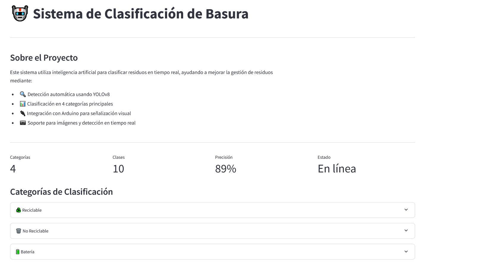
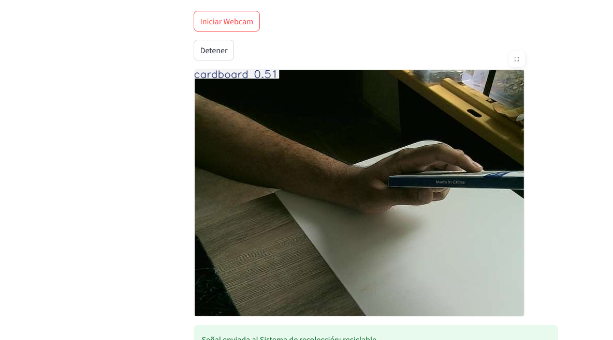
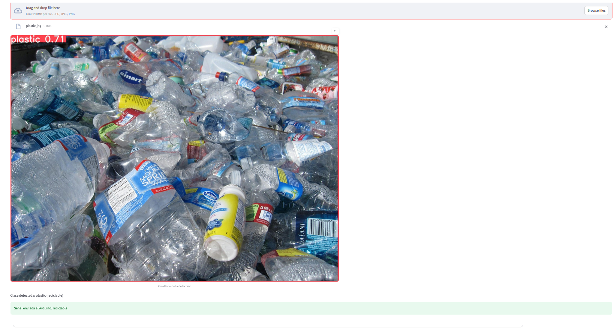

# Clasificación de Basura con YOLOv8

Este proyecto implementa un sistema de clasificación de basura utilizando el modelo YOLOv8 y técnicas de aprendizaje por transferencia. El sistema conecta con Arduino para indicar mediante LEDs la categoría de residuo detectado.

## Requisitos Previos

- Python 3.8 o superior
- Arduino UNO o compatible
- Webcam (opcional para detección en tiempo real)
- Git (opcional, para clonar el repositorio)

## Configuración del Entorno

1. **Clonar el Repositorio**

   ```bash
   git clone https://github.com/tu_usuario/tu_repositorio.git
   cd tu_repositorio
   ```

2. **Crear un Entorno Virtual**

   ```bash
   python -m venv env
   ```

   Para activar el entorno virtual:
   - En Windows:
     ```bash
     .\env\Scripts\activate
     ```
   - En macOS/Linux:
     ```bash
     source env/bin/activate
     ```

3. **Instalación de Dependencias**

   ```bash
   pip install -r requirements.txt
   
   # Desinstalar versiones existentes de PyTorch
   pip uninstall torch torchvision torchaudio
   
   # Instalar PyTorch según tu sistema
   # Visita https://pytorch.org/get-started/locally/
   # Selecciona las opciones según tu sistema:
   # - PyTorch Build: Stable
   # - Your OS: Windows
   # - Package: Pip
   # - Language: Python
   # - Compute Platform: CUDA (si tienes GPU) o CPU
   
   # Por ejemplo, para Windows + CUDA 12.1:
   pip3 install torch torchvision torchaudio --index-url https://download.pytorch.org/whl/cu121
   
   # O para CPU solamente:
   pip3 install torch torchvision torchaudio
   ```

## Configuración del Hardware

1. **Conectar LEDs al Arduino**
   - LED Orgánico: Pin 2
   - LED Batería: Pin 3
   - LED Reciclable: Pin 4
   - LED No Reciclable: Pin 5

2. **Cargar el Código Arduino**
   - Abrir el archivo `ino/main/main.ino` en el IDE de Arduino
   - Cargar el código al Arduino

## Ejecución del Proyecto

1. **Iniciar la Aplicación**

   Si tienes Make instalado:
   ```bash
   make run
   ```

   Si no tienes Make instalado:
   ```bash
   streamlit run main.py
   ```

2. **Usar la Interfaz**
   
   
   *Interfaz principal de la aplicación mostrando los modos de detección disponibles*

   - Seleccionar modo de detección: "Subir Imagen" o "Webcam"

   
   *Detección en tiempo real usando la webcam con botones de control*

   - Para webcam: 
     - Usar los botones "Iniciar Webcam" y "Detener"
     - La detección se realiza automáticamente sobre el video en vivo

   
   *Área de carga de imágenes y resultados de la detección*

   - Para imágenes: 
     - Arrastrar o hacer clic para seleccionar una imagen
     - Los resultados se muestran con cajas delimitadoras y etiquetas
     - El LED correspondiente en el Arduino se iluminará según la categoría detectada


## Categorías de Clasificación

- **Reciclable (R)**: Metal, Vidrio, Papel, Cartón, Plástico
- **No Reciclable (N)**: Basura general, Zapatos, Ropa
- **Batería (B)**: Baterías y dispositivos electrónicos
- **Orgánico (O)**: Residuos biológicos y alimentos

## Dataset

[Dataset del proyecto](https://universe.roboflow.com/ia-wx3de/clasificacion-de-basura-wxd8k)

## Recursos y Referencias

- [Documentación de YOLOv8](https://docs.ultralytics.com/)
- [Ultralytics GitHub](https://github.com/ultralytics/ultralytics)

